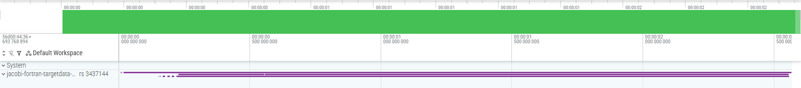
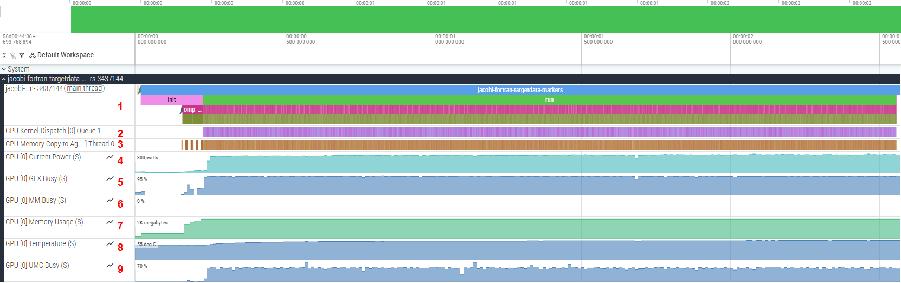
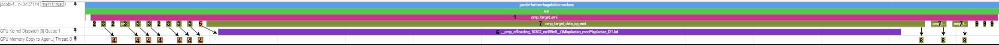
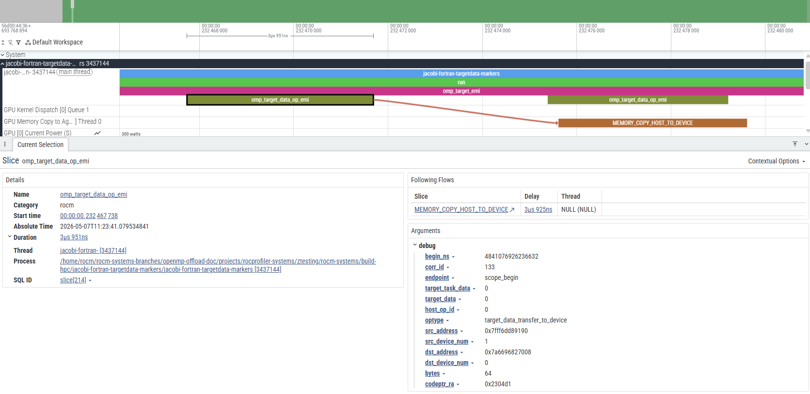

.. meta::
    :description: ROCm Systems Profiler OpenMP performance profiling, including Fortran offloading support
    :keywords: rocprof-sys, rocprofiler-systems, ROCm, tips, how to, profiler, tracking, OpenMP, OMPT, AMD, Offload, Fortran

**************************************************************************
OpenMP performance profiling for C/C++/Fortran host and offload programs
**************************************************************************

`ROCm Systems Profiler <https://github.com/ROCm/rocm-systems/tree/develop/projects/rocprofiler-systems>`_ supports profiling of OpenMP programs on ROCm 6.4.0 or higher.

OpenMP performance data is captured by intercepting callbacks generated by the OpenMP Tools Interface (OMPT) using `ROCprofiler-SDK <https://github.com/ROCm/rocm-systems/tree/develop/projects/rocprofiler-sdk>`_.
The minimum ROCm version of 6.4.0 is required as this is the version where ROCprofiler-SDK introduced support for OMPT.

Only a subset of OMPT callbacks are processed. The list of supported callbacks can be viewed by running the following command:

.. code-block:: shell

    rocprof-sys-avail --list-operations ompt

Profiling a Fortran program that uses GPU offloading
=====================================================

.. tip::

   The steps in this section also apply to C/C++ programs.

For this example, we will be using the `jacobi-fortran-targetdata-markers example <https://github.com/ROCm/rocm-systems/tree/develop/projects/rocprofiler-systems/examples/hpc/jacobi-fortran-targetdata-markers>`_.

Building the example
---------------------------------------------

This example uses ``amdflang`` as the Fortran compiler. To begin, clone the ``rocm-systems`` repository and sparse checkout the necessary examples.

.. code-block:: shell

    git clone --no-checkout --filter=blob:none --depth=1 --branch develop https://github.com/ROCm/rocm-systems.git
    cd rocm-systems
    git sparse-checkout init --cone
    git sparse-checkout set projects/rocprofiler-systems/examples
    git checkout develop

Build only the ``jacobi-fortran-targetdata-markers`` example

.. code-block:: shell

    rm -rf build-hpc
    cmake -S projects/rocprofiler-systems/examples/hpc \
        -B build-hpc \
        -DCMAKE_PREFIX_PATH=/opt/rocm
    cmake --build build-hpc --target jacobi-fortran-targetdata-markers
    export JACOBI_FORTRAN_BIN=$PWD/build-hpc/jacobi-fortran-targetdata-markers/jacobi-fortran-targetdata-markers
    cd ..

The resulting binary is at ``rocm-systems/build-hpc/jacobi-fortran-targetdata-markers/jacobi-fortran-targetdata-markers``.

.. note::

    This example requires the ``hipfort`` Fortran module file
    (``hipfort.mod``). Install it via the ``hipfort-dev`` package on
    Debian/Ubuntu or the ``hipfort-devel`` package on RHEL/Rocky/SLES.

Collecting a trace with rocprof-sys-run
------------------------------------------------

Callback APIs, such as OMPT, can be traced using ``rocprof-sys-run`` with the ``--preset=trace-openmp`` option.
To collect a trace for the Jacobi example, run the following command:

.. code-block:: shell

    rocprof-sys-run --preset=trace-openmp -- "$JACOBI_FORTRAN_BIN"

Once the command completes, a ``.proto`` file will be generated in the output directory:

.. code-block:: shell

    rocprofsys-jacobi-fortran-targetdata-markers-output/<timestamp>/

By default, this file contains all captured traces from the profiling session.

.. tip::

    More information about presets can be found in the :doc:`Using preset profiles <./using-preset-profiles>` documentation.

Understanding the proto file output
-----------------------------------------------

To view the generated ``.proto`` file in a browser, open the `Perfetto UI page <https://ui.perfetto.dev/>`_. Then, click on ``Open trace file`` and select the ``.proto`` file.
The output trace should resemble the following image:

To view the collected traces, click on the drop-down arrow in the ``jacobi-fortran-targetdata-markers`` track. You will then be able to see the full trace, which should resemble:

.. tip::
    You can pin important tracks in Perfetto by hovering over the track name and clicking the pin icon.

Multiple tracks are displayed, each representing different information:
    1. Shows the events captured on the main thread. The main program is executed here (represented by the trace labelled ``jacobi-fortran-targetdata-markers``).
    2. Shows GPU kernel executions.
    3. Shows memory copy operations between agents (CPU/GPU).
    4. Shows the power being used by the GPU.
    5. Measures graphics engine utilization as a percentage.
    6. Measures multimedia engine activity as a percentage.
    7. Measures VRAM consumption.
    8. Shows GPU temperature in Celsius.
    9. Measures memory controller utilization as a percentage.

For this example, the important tracks are ``jacobi-fortran-targetdata-markers`` (1), ``GPU Kernel Dispatch`` (2), and ``GPU Memory Copy to Agent`` (3).

.. tip::

    Certain events have extra information attached to them which can be viewed by selecting the event and looking at its details and argument fields:

    .. image:: ../data/openmp-profiling/perfetto-jacobi-trace-details.png
        :alt: Zoomed in view of the jacobi track showing details for the first ``omp_target_emi`` event
        :width: 800

Visualizing data transfer and kernel execution on the GPU
------------------------------------------------------------

In this program, there are specific OpenMP constructs that offload compute to the GPU. As an example, consider the `laplacian subroutine <https://github.com/ROCm/rocm-systems/blob/develop/projects/rocprofiler-systems/examples/hpc/jacobi-fortran-targetdata-markers/laplacian.f90#L11>`_
in ``laplacian.f90`` which contains the following OpenMP code block:

.. code-block:: fortran

  !$omp target teams distribute parallel do collapse(2)
  do j = 2,mesh%n_y-1
      do i = 2,mesh%n_x-1
      au(i,j) = (-u(i-1,j)+2._RK*u(i,j)-u(i+1,j))*invdx2 &
              + (-u(i,j-1)+2._RK*u(i,j)-u(i,j+1))*invdy2
      end do
  end do

This OpenMP construct offloads the loop to the GPU. Due to the nature of the program, this specific kernel code is executed many times.
The easiest way to locate the events linked to the execution of this code is to find the corresponding kernel dispatch in the ``GPU Kernel Dispatch`` track.
For ``flang`` based compilers (which includes ``amdflang``), the kernel has the following name:

.. code-block:: shell

  __omp_offloading_<Device-ID>_<File-ID>_QMlaplacian_modPlaplacian_l22.kd

``Device-ID`` and ``File-ID`` are unique to the system and are not important for our purposes.

In general, for ``flang`` compiled code containing modules with subroutines using OpenMP to perform GPU offloading, the kernel's name will be of the following form:

.. code-block:: shell

  __omp_offloading_<Device-ID>_<File-ID>_QM<module-Name>P<subroutine-Name>_l<OpenMP-Pragma-Source-Line>[_<Count-ID>].kd

.. note::

    * The ``<OpenMP-Pragma-Source-Line>`` is the line number corresponding to the OpenMP pragma in the source code.
    * ``Count-ID`` is appended when multiple OpenMP offload constructs exist on the same source line. Since the Jacobi example has only one construct per line, ``Count-ID`` is omitted.

The image below shows a group of events that correspond to the execution of the block above:

The general sequence of events for this code block is as follows:
    1. An ``omp_target_emi`` callback is generated and spans the entire duration of the OpenMP ``target teams`` construct.
    2. Memory is allocated on the GPU for variables. This is represented by an ``omp_target_data_op_emi`` event with ``optype = target_data_alloc``.
    3. The variables are then transferred to the GPU. This is represented by an ``omp_target_data_op_emi`` event with ``optype = target_data_transfer_to_device``.
    4. A corresponding ``MEMORY_COPY_HOST_TO_DEVICE`` is generated in the ``GPU Memory Copy to Agent`` track for each occurrence of (3).
    5. Once the necessary data transfers are complete, the kernel can be launched. An ``omp_target_submit_emi`` event is generated and points to the kernel being executed on the GPU.
    6. A corresponding ``__omp_offloading`` kernel is generated on the ``GPU Kernel Dispatch`` track for each occurrence of (5), representing the GPU code being executed.
    7. Once complete, the data is transferred back to the host. This is represented by an ``omp_target_data_op_emi`` event with ``optype = target_data_transfer_from_device``.
    8. A corresponding ``MEMORY_COPY_DEVICE_TO_HOST`` is generated in the ``GPU Memory Copy to Agent`` track for each occurrence of (7).
    9. The previously allocated memory is deallocated from the GPU. This is represented by an ``omp_target_data_op_emi`` event with ``optype = target_data_delete``.

In general, if an event directly relates to another event, an arrow will be generated between the two. These arrows are called "flow events". A flow event is visible only when an event on a track is selected.
For the sake of showing all relations at once, black arrows were inserted in the image above.

The image below shows the standard way that flow events are displayed in Perfetto.

Instrumenting the application with rocprof-sys-instrument
-------------------------------------------------------------

The application can be instrumented using ``rocprof-sys-instrument`` to gather more data than would be obtained from tracing using ``rocprof-sys-run`` alone.
More details on ``rocprof-sys-instrument`` and the data it gathers can be found in the :doc:`data collection modes document <../conceptual/data-collection-modes>`.

.. code-block:: shell

    rocprof-sys-instrument -o jacobi.inst -- "$JACOBI_FORTRAN_BIN"

This command generates an instrumented binary, ``jacobi.inst``. To profile this binary with OMPT tracing enabled, run the following command:

.. code-block:: shell

    rocprof-sys-run --preset=trace-openmp -- ./jacobi.inst

Once profiling completes, a ``.proto`` file will be generated in the output directory:

.. code-block:: shell

    rocprofsys-jacobi-inst-output/<timestamp>/

This ``.proto`` file can be viewed using the same method described in the previous section.
Compared to the trace from the preset-only run, the instrumented trace additionally surfaces user-defined functions in the ``jacobi-fortran-targetdata-markers`` track, allowing application-level call paths to be correlated with OMPT and GPU activity.

.. important::

    With ``rocprof-sys-instrument``, data on user-defined functions can be gathered. However, default values on certain settings
    may prevent the expected function from being instrumented. For details, see the :doc:`selective instrumentation guide <./instrumenting-rewriting-binary-application>`.

Environment variable configuration
===================================

The ``--preset=trace-openmp`` option enables OMPT capture automatically. When you
are not using a preset, or you want to fine-tune what is captured, the corresponding
environment variables can be set instead.

To enable OMPT callback capture without a preset:

.. code-block:: shell

    ROCPROFSYS_USE_OMPT=ON

.. tip::

    Creating a default configuration file helps maintain consistent profiling settings across sessions.
    For details, see the :doc:`configuring runtime options guide <./configuring-runtime-options>`.

.. note::

    If you are interested in seeing how the compiler translates the OpenMP offload
    constructs into ``hsa`` function calls, you can use either the more detailed
    ``--preset=trace-hpc`` preset or add ``hsa_api`` to the ``ROCPROFSYS_ROCM_DOMAINS``
    environment variable. Because setting ``ROCPROFSYS_ROCM_DOMAINS`` *replaces*
    the default domain list, include the default domains alongside ``hsa_api``:

    .. code-block:: shell

        ROCPROFSYS_ROCM_DOMAINS=hip_runtime_api,marker_api,kernel_dispatch,memory_copy,scratch_memory,hsa_api
